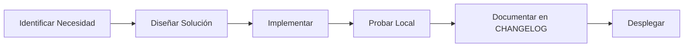

# 📐 COETE-TOOLS: Metodología de Desarrollo

> Guía para el desarrollo y mantenimiento del ecosistema de herramientas operativas.

---

## 1. Stack Tecnológico

| Capa           | Tecnología         | Razón                                              |
| :------------- | :----------------- | :------------------------------------------------- |
| **Frontend**   | React 18 (CDN)     | Sin build, editable en cualquier editor            |
| **Estilos**    | TailwindCSS (CDN)  | Rápido, responsivo, modo oscuro nativo             |
| **Backend**    | Firebase Firestore | Base de datos en tiempo real, gratis tier generoso |
| **Despliegue** | Archivos estáticos | Puede correr desde cualquier servidor o local      |

---

## 2. Estructura de Archivos

```
01_COETE_TOOLS/
├── cierre.html          # App de cierre de turno
├── dashboard.html       # Panel de control
├── carta.html           # Menú digital (reserva)
├── cuentas.html         # (Futuro) Gestión de facturas
├── mantenciones.html    # (Futuro) Control de equipos
├── eventos.html         # (Futuro) Cotizador
└── docs/
    ├── ROADMAP.md       # Hoja de ruta
    ├── METHODOLOGY.md   # Este archivo
    ├── CHANGELOG_cierre.md
    ├── CHANGELOG_dashboard.md
    └── CHANGELOG_carta.md
```

---

## 3. Convenciones de Código

### Nomenclatura

- **Archivos**: `kebab-case.html` o `camelCase.html`
- **Componentes React**: `PascalCase` (ej: `ReporteApp`)
- **Funciones**: `camelCase` (ej: `generarTextoWhatsApp`)
- **Variables de estado**: `camelCase` (ej: `formData`, `stockCritico`)

### Colores Brand

```css
--coete-orange: #ff6b00;
--coete-dark: #1e293b;
--coete-light: #f8fafc;
```

### Estructura de Componente

```javascript
const MiComponente = () => {
  // 1. Estados
  const [estado, setEstado] = useState(inicial);

  // 2. Efectos
  useEffect(() => {
    /* ... */
  }, []);

  // 3. Handlers
  const handleAccion = () => {
    /* ... */
  };

  // 4. Render
  return React.createElement(
    "div",
    {
      /* props */
    } /* children */
  );
};
```

---

## 4. Flujo de Trabajo

### Ciclo de Desarrollo



### Antes de cada cambio

1. **Backup**: Copiar archivo a `_backup/` si es cambio mayor
2. **Branch mental**: Documentar qué se va a cambiar
3. **Test local**: Probar en navegador antes de subir

### Después de cada cambio

1. Actualizar `CHANGELOG_*.md` correspondiente
2. Actualizar versión en el código (si aplica)
3. Actualizar `ROADMAP.md` marcando tarea como ✅

---

## 5. Firebase: Guía Rápida

### Consola

- URL: [console.firebase.google.com](https://console.firebase.google.com)
- Proyecto: `coete-system`

### Colecciones Actuales

| Colección | Uso                          |
| :-------- | :--------------------------- |
| `cierres` | Registros de cierre de turno |

### Estructura de Documento `cierres`

```javascript
{
    fecha: Timestamp,           // serverTimestamp()
    fechaString: "23-12-25",    // Para display
    responsable: "Victor",
    totalVenta: 450000,
    efectivo: 150000,
    debito: 200000,
    credito: 50000,
    transferencias: 50000,
    propinas: 25000,
    gastos: 5000,
    diferenciaCaja: 0,
    novedades: "Sin novedades",
    stockFaltante: ["Café Grano", "Leche Entera"]  // Array de strings
}
```

### Exportar Datos

Para exportar a Excel desde Firebase:

1. Ir a Firestore → colección `cierres`
2. Click en menú ⋮ → Exportar
3. Seleccionar formato (JSON/CSV)
4. Procesar en Excel/Google Sheets

---

## 6. Versionado

### Semántico (SemVer)

`vX.Y.Z` donde:

- **X**: Cambio mayor (nueva funcionalidad core)
- **Y**: Feature nueva
- **Z**: Bugfix o mejora menor

### Versiones Actuales

| App            | Versión | Última Actualización |
| :------------- | :-----: | :------------------- |
| cierre.html    |  v2.1   | Dic 2024             |
| dashboard.html |  v1.0   | Dic 2024             |
| carta.html     |  v1.0   | Dic 2024 (deprecado) |

---

## 7. Troubleshooting

| Problema                       | Solución                                     |
| :----------------------------- | :------------------------------------------- |
| Firebase no conecta            | Verificar API Key y proyecto en consola      |
| Datos no aparecen en Dashboard | Verificar que hay documentos en `cierres`    |
| WhatsApp no copia texto        | Verificar permisos de clipboard en navegador |
| Modo oscuro no funciona        | Limpiar caché del navegador                  |
